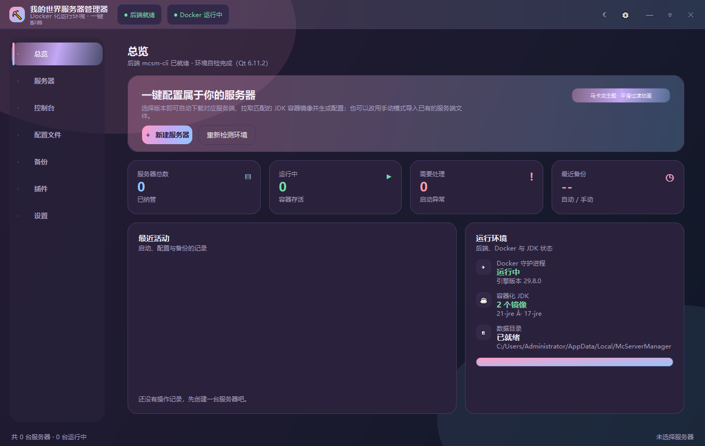
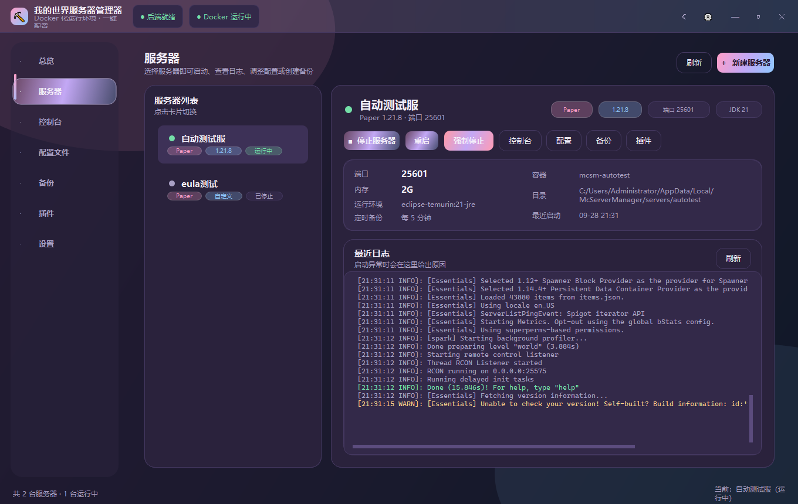
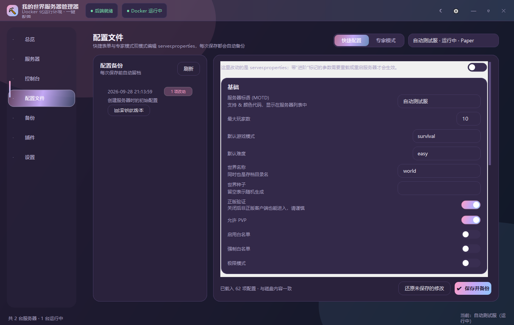
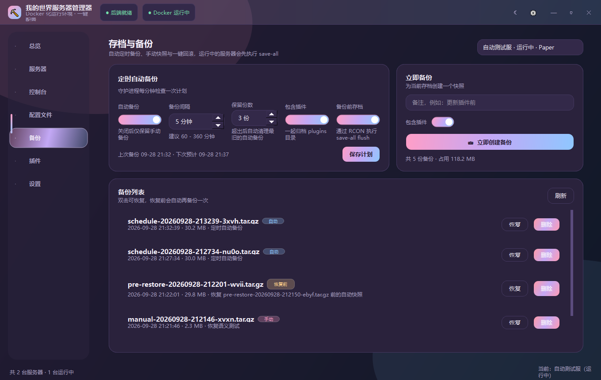
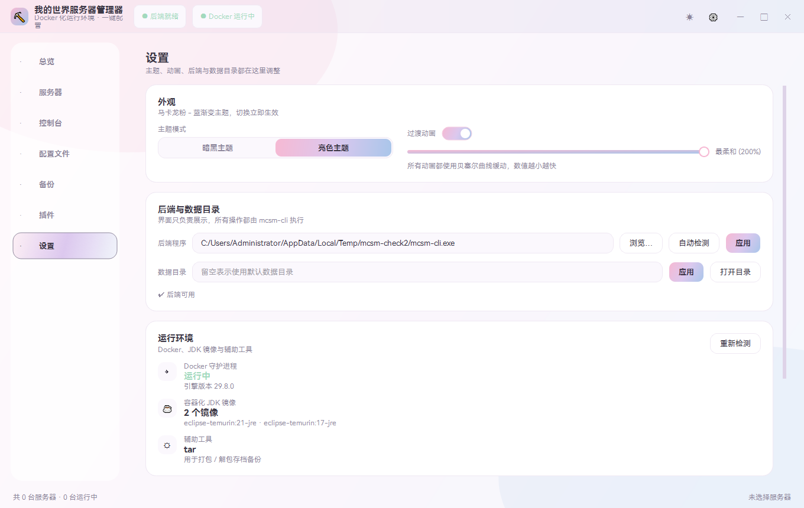
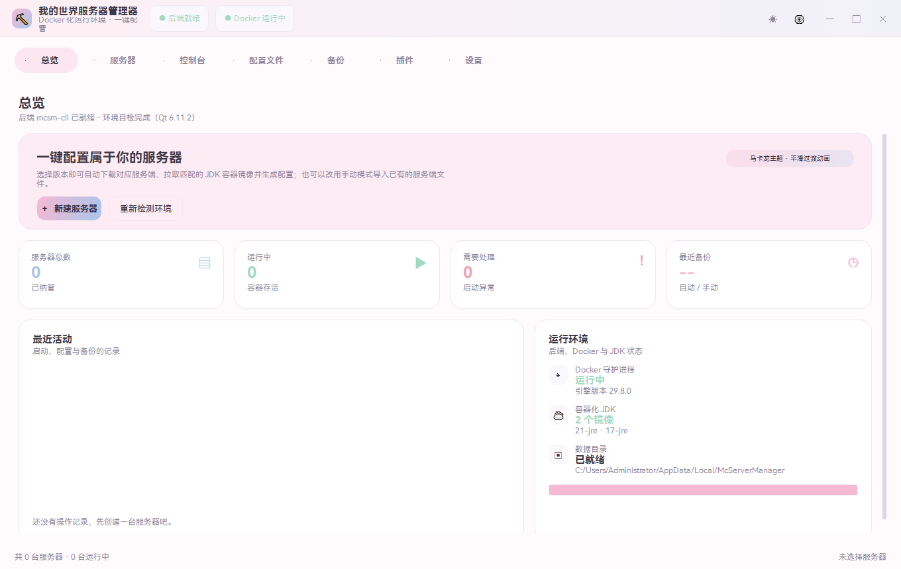

# McServerManager · 我的世界服务器管理器

> 用 Qt 6 + C++ 写的 Minecraft 服务器管理器：**桌面端负责界面，后端是一个 CLI，所有服务端都跑在 Docker 容器里**。
> 宿主机不需要安装 Java，不同服务器可以用不同的 JDK 版本。

<p>
  
  
  
  
  
</p>

---

## 这是什么

一个面向个人/小团体的 Minecraft 服务器管理器。选好版本点一下，它会自动下载对应的服务端、
拉取匹配的 JDK 容器镜像、生成配置文件并把服务器跑起来；之后可以在图形界面里看实时日志、
发控制台指令、改配置、装插件、定时备份和回滚。

**前后端分离**：界面（Qt Widgets）只做展示与交互，所有实际动作都由同目录下的 `mcsm-cli` 执行，
因此整套功能都可以脚本化，也方便把界面换成别的技术栈。

```
┌──────────────────────────────┐   JSON over stdout   ┌──────────────────────────────┐
│  McServerManager (Qt Widgets)│ ───────────────────► │  mcsm-cli (Qt Core)          │
│  主题 / 动画 / 页面           │ ◄─────────────────── │  Docker · 下载 · 配置 · 备份  │
└──────────────────────────────┘   NDJSON 进度 / 日志   └──────────────────────────────┘
                                                                   │
                                                     docker run + bind mount → /data
                                                     eclipse-temurin:XX-jre
```

## 功能

**服务器与运行环境**

- 一键自动配置：选择服务端类型（Paper / Purpur / 原版 / Fabric）与游戏版本，自动下载服务端、
  拉取对应的 JDK 容器镜像、生成 `server.properties`、`eula.txt` 与启动脚本
- 手动模式：导入自己的服务端 jar，并指定运行镜像
- JDK 全部在容器内，宿主机零污染；按版本自动匹配（`26.x → JDK 25`、`1.21 → 21`、`1.20.4 → 17`、`1.16.5 → 8`…）
- 启动失败会给出可读原因（端口占用 / JDK 不匹配 / EULA 未同意 / 内存不足 / 服务端损坏…）并附上日志末尾

**管理**

- 控制台：实时跟随容器日志（按等级着色），通过 RCON 发送指令，内置常用快捷指令
- 配置文件：**快捷配置**（表单，35 项带说明）与**专家模式**（直接编辑原文，带语法检查）双模式
- 每次保存配置前自动留档，可随时精确回滚（记录改动的 key / 原值 / 新值）
- 备份：定时自动备份（间隔 / 保留份数 / 是否含插件 / 备份前是否先 `save-all`），手动快照，一键恢复
- 服务器插件：从 Modrinth / Hangar 搜索并一键安装到某台服务器，支持启停与删除
- 多服务器：每台服务器独立端口、内存、JDK 版本与备份计划

**管理器插件（Plugin SDK）**

管理器本身也可以被插件扩展，插件包支持 **本地 zip** 或 **URL** 导入，
导入时自动识别作用域（前端 / 后端 / Web / 全局）：

| 类型 | 能力 |
| --- | --- |
| 前端扩展 | 用 `mcsm.*` API 注册页面（表格 / 按钮 / 日志 / 富文本…），订阅事件，调用任意后端命令 |
| 后端服务 | JSON-Line 钩子与自定义 RPC；`server.beforeStart` 可返回 JVM / 容器参数补丁 |
| 支持库 / Web 面板 | 自带本地 HTTP 服务，管理器负责启动、停止并一键打开浏览器面板 |
| 全局 | 同时含 `frontend/` 与 `backend/`，共享同一个 `plugin.json` |

导入入口：**设置 → 插件扩展 → 添加插件**；命令行等价入口为 `mcsm-cli plugin package …`。
解压使用随包内置的 7-Zip，目标机器无需安装压缩软件。详见 [`docs/PLUGIN-SDK.md`](docs/PLUGIN-SDK.md)。

**界面**

- 暗黑 / 亮色主题，马卡龙粉-蓝配色，可切换**渐变**与**纯色简洁**两种风格
- 所有过渡动画使用贝塞尔曲线缓动，速度可调（或整体关闭）
- 内置多种字体预设（HarmonyOS Sans SC / Noto Sans SC / 思源黑体 / 微软雅黑 UI / 等线），也可选用系统里的任意字体
- 无边框窗口、自定义标题栏、平滑页面切换、Toast 提醒
- 设置页左侧菜单固定尺寸：实验性功能开关与「返回主页」始终贴在窗口底部，内容再长也不会被滚走

## 界面截图

| 总览（暗黑 + 渐变） | 服务器详情与日志 |
| --- | --- |
|  |  |

| 配置文件（快捷 / 专家） | 备份与定时计划 |
| --- | --- |
|  |  |

| 设置（亮色，独立左菜单） | 纯色简洁风格 |
| --- | --- |
|  |  |

## 快速开始

### 1. 下载便携版

到 [Releases](../../releases) 下载 `McServerManager-<版本>-win64.zip`，解压到任意目录即可，
**不需要安装 Qt 或 Java**。

### 2. 安装 Docker Desktop

服务器运行在容器里，所以必须先装好 [Docker Desktop](https://www.docker.com/products/docker-desktop/) 并保持运行。
国内网络建议在 Docker Desktop 的 `Settings → Docker Engine` 里配置镜像加速（`registry-mirrors`）。

### 3. 创建服务器

双击 `McServerManager.exe` → 首页点「新建服务器」→ 选择类型与版本 → 开始创建。
进度条会依次显示「解析版本 → 下载服务端 → 拉取 JDK 镜像 → 写入配置」。

创建完成后回到「服务器」页点「一键启动」，首次启动需要生成世界，通常 30–120 秒。

## 从源码构建

需要 **Qt 6.4+**（Core / Gui / Widgets / Network）、CMake ≥ 3.19、C++17 编译器。

### Windows

```powershell
# 自动探测 Qt 套件、MinGW、Ninja、CMake，并处理好 PATH
.\scripts\build-windows.ps1

# 也可以指定套件；-Deploy 会调用 windeployqt 生成可直接分发的目录
.\scripts\build-windows.ps1 -QtDir "D:\qt\6.11.2\mingw_64" -Deploy

# 全新构建
.\scripts\build-windows.ps1 -QtDir "D:\qt\6.11.2\mingw_64" -Reconfigure
```

> MinGW 套件下如果出现 `cc1plus.exe` 退出码 `0xC0000135`，是因为编译器找不到自己的 DLL
> （`D:\qt\Tools\mingw1310_64\bin` 不在 `PATH`）。构建脚本已自动处理这一点。

### Linux / macOS

```bash
./scripts/build-unix.sh /path/to/Qt/6.6.3/gcc_64
```

### 手动构建

```bash
cmake -S . -B build -DCMAKE_PREFIX_PATH=/path/to/Qt/6.6.3/gcc_64 -DCMAKE_BUILD_TYPE=Release
cmake --build build --parallel
```

产物：`build/bin/mcsm-cli`（后端）与 `build/bin/McServerManager`（界面）。
界面会在同级目录、`backend/`、`bin/`、`build/bin/` 以及 `PATH` 中查找 `mcsm-cli`，
也可以在「设置 → 运行环境」里指定，或设置环境变量 `MCSM_BACKEND`。

## 命令行

后端是可独立使用的 CLI，所有输出都是 JSON：

```bash
mcsm-cli doctor                                    # 环境自检
mcsm-cli versions --type paper                     # 可用版本 + 推荐 JDK
mcsm-cli install --name 生存服 --type paper --version 1.21.8 --memory 4G
mcsm-cli server list / start / stop / restart --id 生存服
mcsm-cli server command --id 生存服 --command "say hi"
mcsm-cli config apply --id 生存服 --values "{\"motd\":\"欢迎\"}"
mcsm-cli backup create --id 生存服 --note "更新插件前"
mcsm-cli daemon --interval 60                      # 常驻定时备份

# 管理器插件（Plugin SDK）
mcsm-cli plugin api                                # 导出机器可读的接口清单
mcsm-cli plugin packages                           # 已安装的管理器插件
mcsm-cli plugin package inspect --zip my-plugin-1.0.0.zip       # 只校验并识别作用域
mcsm-cli plugin package install --zip my-plugin-1.0.0.zip
mcsm-cli plugin package install --url https://example.com/my-plugin-1.0.0.zip --force
mcsm-cli plugin package enable|disable|remove --name com.example.my-plugin
mcsm-cli plugin call --name com.example.my-plugin --method summary
mcsm-cli plugin service start --name com.example.ops-console     # 启动插件自带的 Web 面板
```

完整命令列表见 [`docs/CLI.md`](docs/CLI.md)，协议说明见 [`docs/PROTOCOL.md`](docs/PROTOCOL.md)。

## 文档

| 文档 | 内容 |
| --- | --- |
| [`docs/ARCHITECTURE.md`](docs/ARCHITECTURE.md) | 目录结构、模块分工、数据流、设计取舍 |
| [`docs/CLI.md`](docs/CLI.md) | 后端命令与参数完整参考 |
| [`docs/PROTOCOL.md`](docs/PROTOCOL.md) | 前后端 JSON 协议、NDJSON 进度与日志流 |
| [`docs/PLUGIN-SDK.md`](docs/PLUGIN-SDK.md) | **管理器插件接口**：包结构、`plugin.json` 全字段、前端 `mcsm.*` API、后端 JSON-Line 钩子与启动补丁、Web 面板、权限与调试 |
| [`docs/TROUBLESHOOTING.md`](docs/TROUBLESHOOTING.md) | 常见问题与排查方法 |
| [`examples/plugins/`](examples/plugins) | 三个可直接安装的示例插件（前端 / 后端 / 全局）+ 打包脚本 |
| [`packaging/QUICKSTART.txt`](packaging/QUICKSTART.txt) | 面向最终用户的上手说明（随发行包分发） |
| [`CHANGELOG.md`](CHANGELOG.md) | 版本记录 |

## 数据目录

默认位置：Windows `%LOCALAPPDATA%\McServerManager`，Linux/macOS `~/.local/share/McServerManager`。
可用 `--home <目录>`、环境变量 `MCSM_HOME` 或界面里的「数据目录」修改。

```
McServerManager/
├─ servers.json            服务器注册表
├─ gui.ini                 界面设置（主题 / 字体 / 后端路径）
├─ logs/backend.log        后端诊断日志
├─ plugins/                管理器插件包（Plugin SDK）
│  ├─ registry.json        插件注册表（id / 版本 / 作用域 / 启用状态 / 来源）
│  ├─ <插件 id>/           插件解压后的内容（含 install.json）
│  └─ .data/<插件 id>/     插件私有数据
└─ servers/<id>/           单个服务器目录（容器内挂载为 /data）
   ├─ server.jar  server.properties  eula.txt  start.sh  docker-compose.yml
   ├─ .mcsm/              管理器内部状态（含 start-patch.json 插件启动补丁）
   ├─ plugins/            插件目录
   ├─ backups/            存档归档 + index.json
   ├─ config-backups/     server.properties 历史版本 + index.json
   └─ world/ world_nether/ world_the_end/
```

## 自带工具

```bash
python tools/static_check.py       # 源码一致性检查（include / 括号 / 声明实现 / 编码陷阱 / CMake 清单）
powershell -File tools/smoke-test.ps1   # 后端冒烟测试（56 项，含插件包回归，不需要 Docker）
powershell -File tools/gui-smoke.ps1    # 界面冒烟测试（启动、拖拽、快速切页残留对比、截图）
powershell -File tools/gui-smoke.ps1 -Page settings-runtime -Resize 1100x700 -Screenshot small.png   # 小窗口布局回归
python tools/check-endpoints.py    # 检查上游 API（Mojang / Paper / Purpur / Fabric / Modrinth…）可用性
python tools/rcon-probe.py 127.0.0.1 25575 <密码>   # RCON 协议探针
python tools/host-runtime-check.py  # 实验性「本机 JDK」模式端到端检查
```

## 打包发行版

```powershell
.\scripts\build-windows.ps1 -QtDir "D:\qt\6.11.2\mingw_64" -Deploy

.\tools\package-release.ps1                       # 纯程序版
.\tools\package-release.ps1 -Flavor with-plugins  # 额外带 plugin-packages\（示例插件 zip，可直接导入）
```

两个风味刻意使用不同名字（`McServerManager-<版本>-win64` 与 `…-win64-with-plugins`），
避免重新生成纯程序版时把带插件的测试包覆盖掉。

## 开发提示

- 新增设置页时，把左侧菜单放进 `PageBase::setSideColumn()` 的固定列里（不要放进 `body()`），
  否则内容变长后菜单会被一起滚走。
- 编码：界面文本用 `QStringLiteral`，不要用 `QLatin1String` 包中文；`tools/static_check.py` 有对应检查。

## 实验性功能

在「设置 → 实验性功能」打开后：

- 自动扫描本机已安装的 JDK（JAVA_HOME、PATH、Program Files 下各厂商目录、常见盘符目录）
- 新建服务器时可选择**本机 JDK**运行方式：把所选 JDK 克隆到服务器目录并直接在本机运行（不经过容器）

该模式仍在打磨中：服务端是本机进程，控制台输入用常驻 `ping` 保持打开（否则 Minecraft 会因 stdin
关闭而刷屏）。用「读到 EOF」的管道方式调用 `mcsm-cli server start` 会等到服务器退出才返回，GUI 不受影响。

## 已知边界

- 仅对 Bukkit 系（Paper / Purpur）提供插件一键安装；原版没有插件 API，Fabric 请把模组放进 `mods/`
- SpigotMC 需要浏览器会话才能下载，因此该来源只提供搜索与页面跳转
- Forge / NeoForge 未纳入自动配置（其安装器需要交互流程），可用手动模式导入构建好的服务端
- 定时备份依赖应用运行（启动时会拉起 `mcsm-cli daemon`）；需要 7×24 时可把该命令注册为系统服务

## 参与开发

欢迎提交 Issue 与 PR。改动前建议先跑一遍：

```bash
python tools/static_check.py && powershell -File tools/smoke-test.ps1
```

代码风格：4 空格缩进、`mcsm` 命名空间、头文件对应同名源文件；界面文本使用中文，注释使用中英混合（保持现有风格即可）。

## 使用 AI 辅助制作

本项目的源码、界面文案与文档在开发过程中**大量使用了 AI 辅助**（代码生成、重构建议、
问题排查与文档撰写），由维护者审核、测试并整合后提交。所有检查脚本都在仓库内公开，
可以自行复现：

```bash
python tools/static_check.py                  # 源码一致性检查
powershell -File tools/smoke-test.ps1         # 后端冒烟测试（67 项，含插件安全用例）
powershell -File tools/gui-smoke.ps1          # 界面冒烟测试（拖拽 / 快速切页 / 截图）
powershell -File tools/ui-perf.ps1            # 界面 CPU 测量（空闲 / 快速切页）
```

项目按"现状"提供，请在使用前自行评估风险（服务器数据、封禁与后续损失由使用者自行承担）。

## 许可

本项目源码采用 **[MIT](LICENSE)** © 2026 McServerManager contributors。

| 组件 | 许可 | 说明 |
| --- | --- | --- |
| 本项目源码 | MIT | 自由使用 / 修改 / 分发，保留版权声明即可 |
| Qt 6（Core / Gui / Widgets / Network / Qml） | **Qt 个人版 / 开源条款**（GPLv3 或 LGPLv3） | 按 Qt 个人版（开源）条款使用：**动态链接**、未修改 Qt 源码；发行包内含 Qt 运行库，可自行替换为兼容版本 |
| 7-Zip（内置 `7zip/7za.exe`） | **LGPL + unRAR 限制** | 仅用于解压插件包；随包附 `third_party/7zip/LICENSE-7zip.txt`，未修改其源码 |

本项目与 Mojang / Microsoft 无关；Minecraft 是 Mojang AB 的商标。
使用本项目创建服务器即表示你同意 [Minecraft EULA](https://aka.ms/MinecraftEULA)。

第三方组件（Qt、7-Zip、Docker 镜像、Minecraft 服务端与插件）的完整声明见
[THIRD_PARTY_NOTICES.md](THIRD_PARTY_NOTICES.md)。

---

<sub>Made with Qt 6 · Frontend and CLI backend are separate processes talking JSON.</sub>
